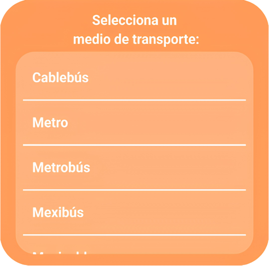
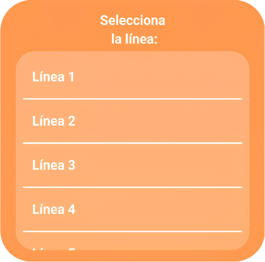
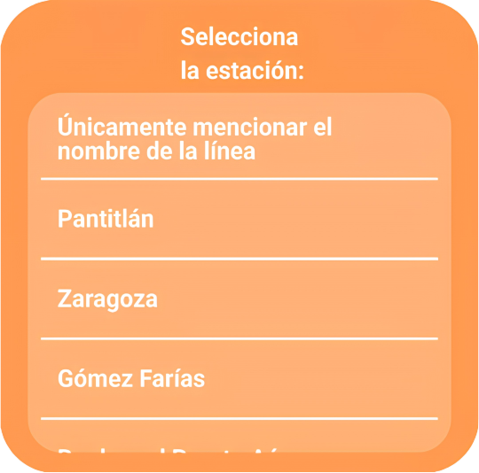
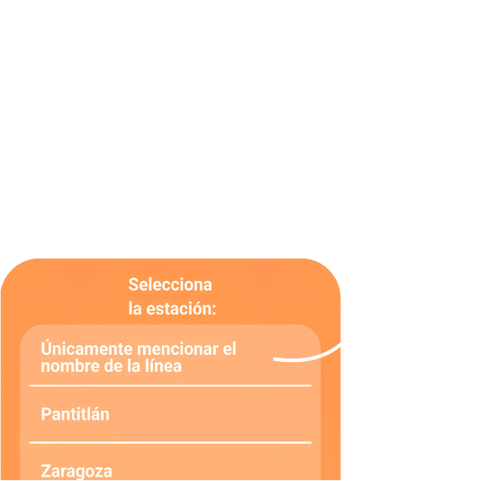
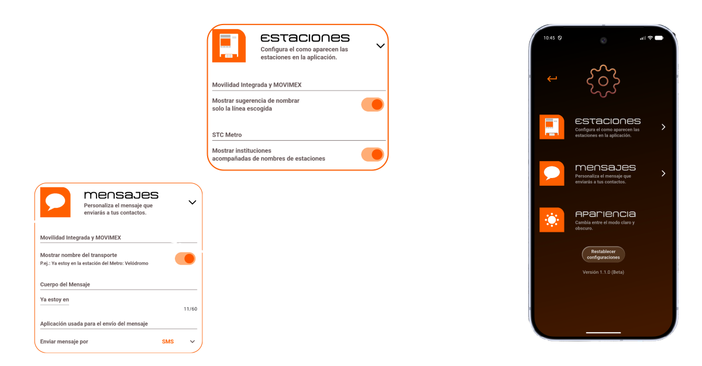

  
   &nbsp;&nbsp;&nbsp;
  

 

# Anuncia mi llegada

Para dispositivos Apple un atajo, en Android una aplicación hecha en Flutter, que permite a usuarios de la red de movilidad integrada de la Ciudad de México y del Estado de México, enviar mensajes de texto de llegada a las estaciones a sus contactos, permitiéndoles personalizar totalmente su mensaje y elegir qué aplicación de mensajería usar.

## ¿Cómo uso la aplicación?

A través de una sola pantalla dinámica, podrás seleccionar el medio de transporte, seguido de la línea y, por último, la estación en la que te encuentras

 

  
  &nbsp;&nbsp;&nbsp;
  
  &nbsp;&nbsp;&nbsp;
  

 

Tu eliges la aplicación de mensajería predeterminada, ya sea: SMS (ideal para zonas subterráneas o con díficil acceso al internet) o WhatsApp.

* **Ajustes y Personalización:** En el menú de configuraciones, podrás definir el cuerpo del mensaje, el modo de apariencia (Claro/Oscuro) y la visibilidad de los nombres de las instituciones.

* **Envío a un toque:** Al seleccionar la estación, la aplicación construirá tu mensaje y abrirá la plataforma de mensajería externa con el texto listo para ser enviado.

  
  &nbsp;&nbsp;&nbsp;
  

 

## ¿Cómo uso el atajo?

El flujo es el mismo, seleccionas el medio de transporte, seguido de la línea y, por último, la estación en la que te encuentras

##  ¿Qué requisitos debo cumplir?

* **Sistema Operativo:** 
Dispositivo móvil con Android.
Dispositivo perteneciente al ecosistema de Apple y sincronizado con tu cuenta de iCloud.
* **Conectividad:** Plan de datos o señal celular (para SMS).
* **Software ajeno:** Contar con una aplicación de gestión de SMS instalada o WhatsApp.

## ¿Cómo la instalo en Android? ( Versión 1.1.2 )

1. Dirígete a la sección de **Releases** en el lateral derecho de este repositorio en GitHub.
2. Descarga el archivo `.apk` de la versión `1.1.1-beta` en tu teléfono.
3. Abre el archivo descargado. Si es la primera vez que instalas una app fuera de Google Play, tu dispositivo mostrará una alerta de seguridad. Toca en **Configuración** y activa el permiso de **"Instalar aplicaciones desconocidas"** para tu navegador o gestor de archivos.
4. Toca **Instalar**. ¡Listo! La aplicación ya estará disponible en tu cajón de aplicaciones.

## ¿Cómo guardo el Atajo en mi dispositivo Apple? 

1. Presiona el siguiente link: https://www.icloud.com/shortcuts/47921cbb1e584304958e39f4d7d0bcd4
2. Das click en el botón "Obtén atajo"
3. Se te redirigirá a la aplicación de Atajos, posteriormente darás click en "Agregar atajo". ¡Listo!, ya estas listo de anunciar tu llegada
---

> [!IMPORTANT]
>
> EL USO DE INTELIGENCIA ARTIFICIAL SE LIMITÓ AL CÓDIGO, NO PARTICIPÓ EN OTRO ASPECTO DEL DESARROLLO.
>
>A continuación se mostrará: El modelo utilizado, sesiones que hubieron, fechas, prompts, cambios que realizó y  como es que funcionan dentro de la aplicación

## Uso de Inteligencia Artificial

### Modelo utilizado

Se utilizó el modelo **opencode/big-pickle** a través de la herramienta **opencode** (CLI de asistencia de desarrollo con IA) para el diseño arquitectónico y la implementación de funcionalidades de la aplicación "Anuncia mi llegada".

### Registro de cambios y prompts

#### Primera sesión — 20 de agosto de 2026

**Prompt enviado (resumen):**
> "Continuando con el desarrollo de mi aplicación. Ya se encuentra la lógica de parseo de archivos JSON en mi_repository.dart que devuelve una lista de objetos TransportsModel (que a su vez contienen listas de LinesModel definidas en mi_model.dart). También tengo configurado go_router en mi archivo de rutas y un widget UI reutilizable llamado SelectorWidget que recibe selectorsTitle y listContent.
> Tarea 1: Actualización del Router — Agrega dos nuevas rutas de go_router: una ruta /lineas (cuyo nombre sea LineScreen.name) que reciba un objeto TransportsModel mediante el extra, y una ruta /estaciones (cuyo nombre sea StationsScreen.name) que reciba un objeto LinesModel mediante el extra.
> Tarea 2: Integración de la UI — Modifica mi TransportsScreen con un FutureBuilder que llame a MiRepository().loadTransports(), crea LineScreen y StationsScreen con navegación entre ellas.
> Tarea 3: Documentación — Crea una sección AI Usage en el README.md."

**Cambios realizados:**
- Se crearon las pantallas `LinesScreen` y `StationsScreen` con navegación vía `go_router`.
- Se modificó `TransportsScreen` para integrar `FutureBuilder` con `MiRepository`.
- Se agregaron rutas `/lineas` y `/estaciones` en `app_router.dart`.
- Se actualizó el barrel file `screens.dart`.
- Se movieron `mi_model.dart` y `mi_repository.dart` de `assets/data/` a `lib/data/` para que las importaciones Dart funcionaran correctamente (los archivos en `assets/` no son importables desde `lib/` en Flutter).
- Se creó la sección "AI Usage" en el README.

#### Segunda sesión — 20 de agosto de 2026

**Prompt enviado (resumen):**
> "Haz estas configuraciones en los selector widget: El listContent que tienen debe de estar con opacidad de 1, no debe de ser afectado por el valor de opacidad del Glass Container. El font que debe de tener el texto que se muestra es 'Nunito', con un tamaño de 17, letterSpacing de 0, fontWeight: FontWeight.w700, color: Colors.white. El espacio entre cada elemento debe ser de 0.7, el Divider debe ser de color blanco, con thickness de 5. Para cada Selector Widget alterno al de Transports Screen: el Orange Container debe tener un ancho acorde al Glass Container dejando 20px de espacio en los lados (configurable), la altura no cambia. El Glass Container debe tener un ancho acorde al espacio de los elementos del listContent con 5px de espacio en cada lado (configurable). El divider debe tener anchura igual al tamaño del listContent menos 9 (configurable). Activa el efecto de rebote para el scroll en Android. Redacta en el apartado de AI Usage los cambios, cómo funcionan, el prompt exacto y la fecha."

**Cambios realizados:**

1. **Refactorización de `SelectorWidget` — Separación de capas de opacidad:**
   - El contenedor de vidrio (glass container) y el contenido del listado ahora son dos widgets `Positioned` hermanos dentro del `Stack`, en lugar de estar anidados.
   - El glass container mantiene su `Opacity(opacity: 0.38)` para el efecto visual de vidrio esmerilado.
   - El contenido del listado se renderiza con opacidad 1.0, fuera de la capa de `Opacity` del glass. Esto permite que el texto y los elementos interactivos se muestren con nitidez total sin verse afectados por la transparencia del fondo.

2. **Cambio de API — de `listContent: Widget?` a `listItems: List<Widget>`:**
   - Anteriormente, `SelectorWidget` recibía un `Widget? listContent` que generalmente era un `ListView.separated` pre-construido. Esto impedía que el widget controlara el scroll physics, el divider o el padding interno.
   - Ahora recibe `List<Widget> listItems` y construye el `ListView.separated` internamente, dando control total sobre:
     - **Scroll physics**: `BouncingScrollPhysics` en Android (efecto de rebote), `ClampingScrollPhysics` en iOS.
     - **Divider**: color blanco, `thickness: 5`, `height: 0.7`, con `indent`/`endIndent` calculados a partir de `dividerWidthModifier`.
     - **Padding interno**: controlado por `listContentPadding` (5px por defecto en cada eje).

3. **Estilo de texto unificado via `DefaultTextStyle`:**
   - Se envuelve el `ListView.separated` en un `DefaultTextStyle` con fuente Nunito, tamaño 17, `fontWeight: w700`, color blanco y `letterSpacing: 0`.
   - Cualquier `Text` dentro de los `listItems` que no tenga un estilo explícito hereda este estilo automáticamente.

4. **Dimensiones dinámicas del contenedor naranja:**
   - El ancho del contenedor naranja ahora se calcula automáticamente: `glassContainerWidth + (orangePadding * 2)`.
   - Para pantallas alternas (Lines, Stations), se puede configurar `glassContainerWidth` según el contenido, y el contenedor naranja se ajusta proporcionalmente.

5. **Divider con ancho configurable:**
   - Cada `Divider` recibe `indent` y `endIndent` iguales a `dividerWidthModifier / 2` (por defecto 4.5px cada lado), reduciendo visualmente la línea del divisor respecto al ancho total del contenido.

6. **Simplificación de pantallas:**
   - `LinesScreen`, `StationsScreen` y `TransportsScreen` ahora solo construyen la lista de `ListTile` y la pasan como `listItems`. Todo el estilo visual (fuente, color, divider, scroll) está centralizado en `SelectorWidget`.

**Cómo funciona en la aplicación:**
Cuando el usuario navega a cualquiera de las tres pantallas de selección, `SelectorWidget` construye un `Stack` con tres capas: el contenedor naranja con degradado y opacidad 0.87, el contenedor de vidrio con opacidad 0.38, y el listado con opacidad 1.0. El listado usa `ListView.separated` con `BouncingScrollPhysics` en Android para dar sensación de rebote al hacer scroll. Los dividers entre elementos son blancos con un grosor de 5px y una separación vertical de 0.7px. El texto hereda el estilo Nunito 17/w700/blanco del `DefaultTextStyle`. Para las pantallas de líneas y estaciones, el ancho del contenedor de vidrio puede configurarse para adaptarse al contenido, y el contenedor naranja se expande automáticamente con 20px de margen en cada lado.

#### Tercera sesión — 20 de agosto de 2026

**Prompt enviado (resumen):**
> "Agrega una ScrollBar funcional (que también haga scroll si se presiona) y colócala en el espacio que se dejó en el lado derecho entre el Orange y el Glass Container. Haz transparente el highlightColor y splashColor de los elementos del listContent. Bloquea la orientación de la aplicación a solo Vertical. Agrega estos cambios, su funcionamiento y prompt exacto en el README."

**Cambios realizados:**

1. **ScrollBar funcional en el `SelectorWidget`:**
   - Se envolvió el `ListView.separated` con un widget `Scrollbar` con `thumbVisibility: true` y `trackVisibility: true`.
   - El scrollbar se posiciona visualmente en el espacio derecho entre el contenedor naranja y el de vidrio (el área de `orangePadding`).
   - Se configuró el tema del scrollbar vía `ScrollbarThemeData`: thumb blanco semitransparente (`alpha: 0.5`), track blanco muy tenue (`alpha: 0.1`), borde transparente, grosor 3px y esquinas redondeadas de 10px.
   - El scrollbar es completamente funcional: al presionar y arrastrar el thumb se desplaza el listado.

2. **HighlightColor y SplashColor transparentes:**
   - Se envolvió el `ListView.separated` en un `Theme` con `splashColor: Colors.transparent` y `highlightColor: Colors.transparent`.
   - Al tocar cualquier `ListTile` del listado, ya no se muestra el efecto de onda (splash) ni el resaltado (highlight) del ink, dando una experiencia visual más limpia.

3. **Orientación bloqueada a vertical:**
   - En `main.dart` se agregó `SystemChrome.setPreferredOrientations([DeviceOrientation.portraitUp, DeviceOrientation.portraitDown])` antes de `runApp()`.
   - La aplicación ahora solo funciona en modo vertical, evitando que la pantalla rote al girar el dispositivo.

#### Cuarta sesión — 21 de agosto de 2026

**Prompt enviado (resumen):**
> "Solamente haz estas tres cosas: -Mueve todo el SettingsView al centro de la pantalla, NO CAMBIES LA POSICIÓN DEL TITLE Y EL SUBTITLE -Haz visibles los SVGAssets y hazlos de tamaño 70px x 70px -Anota estos cambios, su funcionalidad, prompt y fecha en el README"

**Cambios realizados:**

1. **`SettingsView` centrado en pantalla (`settings_screen.dart`):**
   - El `ListView.builder` de `_SettingsView` estaba anclado con `Positioned.fill(top: 300)`, es decir, a una posición fija bajo el engranaje.
   - Ahora se envuelve en `Center` con `Positioned.fill` y el `ListView` usa `shrinkWrap: true` con `padding: EdgeInsets.zero`, de modo que el bloque de los tres ítems se centra vertical y horizontalmente dentro del `Stack`.
   - No se modificó `_CustomListTitle`: las posiciones relativas de `title` y `subtitle` dentro de cada `ListTile` se mantienen intactas.

2. **SVGAssets visibles y a 70x70 px (`settings_items.dart`):**
   - Las rutas de los tres SVG estaban mal escritas (`assets/data/icons/config_icons/*.svg`), lo que lanzaba `Unable to load asset` y cerraba la app al navegar a settings; se corrigieron a `assets/icons/config_icons/*.svg`.
   - Cada `SvgPicture.asset` ahora recibe `width: 70, height: 70`.

3. **Documentación en README:** esta misma sección con los cambios, su funcionamiento, el prompt y la fecha.

**Cómo funciona en la aplicación:**
Al navegar a `/settings`, el `Stack` del `Scaffold` renderiza el engranaje y el botón de regreso en sus posiciones originales, y debajo `_SettingsView` ocupa toda la pantalla pero centra su contenido: el `ListView.builder` con `shrinkWrap` mide su altura real (tres `ListTile`) y `Center` lo coloca en el punto medio de la pantalla. Los iconos SVG de Estaciones, Mensajes y Apariencia cargan desde `assets/icons/config_icons/` (ruta registrada en `pubspec.yaml`) y se muestran con dimensiones fijas de 70x70 px como `leading` de cada elemento.

#### Quinta sesión — 22 de agosto de 2026

**Prompt enviado (resumen):**
> "Implementa el Modo Claro y Oscuro para la aplicación, a partir de lo que ya está hecho en el archivo app_theme.dart, que contiene las constantes de diseño para cada componente que va a modificar su color según el modo establecido por el usuario en la configuración de la aplicación, así como los ThemeData para ambos modos. Si te es útil, se encuentra el ValueNotifier<bool> isTrueDarkMode = ValueNotifier(false); que controla el estado global. Deberás hacer que el cambio entre modo claro y oscuro ocurra en una transición suave y fluida mientras se ejecuta la animación de transición de los íconos de light mode y dark mode. El MapIconLight, renómbralo a MapIcon, cambia el path del asset al momento de cambiar entre modos: 'assets/icons/Map_Icon_Dark.png' en oscuro, 'assets/icons/Map_Icon_W.png' en claro. Haz ese mismo trabajo con la imagen del engranaje de settings: 'assets/icons/config_icons/gear_dark.png' en modo oscuro y 'assets/icons/config_icons/gear_white.png' en modo claro. Para el texto dentro del SelectorWidget déjalos con color blanco fijo; únicamente usa el color para la pantalla de configuraciones: Título claro Colors.black / Subtítulo claro Color.fromRGBO(91, 79, 79, 100); Título oscuro Color.fromRGBO(204, 204, 204, 100) / Subtítulo oscuro Color.fromRGBO(151, 145, 145, 100). Agrega esta sesión en el apartado 'Uso de la Inteligencia Artificial', describe qué cambios hiciste, cómo funcionan, el prompt que te di y la fecha."

**Cambios realizados:**

1. **Estado global (`lib/theme/app_theme.dart`):**
   - Se definió `isTrueDarkMode = ValueNotifier(false)` como única fuente de verdad del tema (`true` = modo oscuro).

2. **`main.dart` — transición suave sincronizada con el toggle:**
   - `MaterialApp.router` quedó envuelto en un `ValueListenableBuilder<bool>` escuchando `isTrueDarkMode`.
   - `theme: AppTheme.lightTheme`, `darkTheme: AppTheme.darkTheme`, `themeMode: isDark ? ThemeMode.dark : ThemeMode.light`.
   - `themeAnimationDuration: const Duration(milliseconds: 500)`: al presionar el toggle, la interpolación entre temas dura ~500 ms, acompañando en simultáneo la animación de expansión del icono `LightDarkThemeToggle`.

3. **`SelectorWidget` (`selector_widget.dart`):**
   - Contenedor naranja: `gradient: isDark ? AppTheme.colorsOfOrangeContainerDM : AppTheme.colorsOfOrangeContianerLM`.
   - Contenedor de vidrio: `color: isDark ? AppTheme.colorOfGlassContainerDM : null` y `gradient: isDark ? null : AppTheme.colorOfGlassContainerLM`.
   - Los textos del título y de los `listItems` permanecen SIEMPRE en `Colors.white`.
   - El listado se envolvió en un `Material(type: MaterialType.transparency)`: los `ListTile` pintan su tinta sobre este Material en lugar de quedar silenciados por el `Container` con fondo de cada pantalla (elimina el aviso "ListTile background color or ink splashes may be invisible").

4. **Renombrado `MapIconLight` → `MapIcon` (`map_icon_white.dart` → `map_icon.dart`):**
   - Evalúa `Theme.of(context).brightness` y alterna el asset entre `'assets/icons/Map_Icon_Dark.png'` y `'assets/icons/Map_Icon_W.png'`. Imports y usos actualizados en `TransportsScreen`, `LinesScreen` y `StationsScreen`.

5. **Fondo dinámico en pantallas (`transports`, `lines`, `stations`, `settings`):**
   - Cada `Scaffold` usa `backgroundColor: Colors.transparent` y su `Stack` se envuelve en un `Container` con `BoxDecoration`: `color: isDark ? null : AppTheme.backgroundColorLM` y `gradient: isDark ? AppTheme.backgroundColorDM : null`.

6. **`SettingsScreen`: engranaje dinámico y textos por modo:**
   - El engranaje alterna entre `'assets/icons/config_icons/gear_dark.png'` y `'assets/icons/config_icons/gear_white.png'`.
   - `_CustomListTitle` re-colorea título y subtítulo según el modo mediante un helper `_withColor` que clona cada `Text` conservando su estilo original y sustituyendo solo el color:
     - Claro: título `Colors.black`, subtítulo `Color.fromRGBO(91, 79, 79, 100)`.
     - Oscuro: título `Color.fromRGBO(204, 204, 204, 100)`, subtítulo `Color.fromRGBO(151, 145, 145, 100)`.

7. **Cableado del interruptor de Apariencia (`settings_items.dart`):**
   - `AppearanceIcon` lee `isTrueDarkMode` (`value: !isTrueDark` para que true = claro en el toggle) y escribe directamente `isTrueDarkMode.value = !value`; el tap sobre la fila del ítem hace lo mismo. Al existir un único notificador no puede haber desincronización.

**Cómo funciona en la aplicación:**
El usuario entra a Ajustes y acciona el interruptor de Apariencia (o toca la fila). Eso muta `isTrueDarkMode`; el `ValueListenableBuilder` de `main.dart` reconstruye `MaterialApp.router` con el `themeMode` opuesto y Flutter interpola ambos `ThemeData` durante 500 ms, logrando una transición gradual que ocurre mientras el icono del toggle termina su animación. Todos los widgets dependientes recalculan `isDark = Theme.of(context).brightness == Brightness.dark` y conmutan sus decoraciones: fondo blanco ↔ degradado diagonal oscuro, naranja tenue ↔ naranja intenso, vidrio degradado ↔ vidrio sólido translúcido, e iconos de mapa y engranaje entre sus versiones clara y oscura sin moverse de su posición.

**Resolución de incidencia y refinamientos (misma sesión):**

1. **Incidencia reportada:** al probar en el dispositivo físico, presionar el interruptor de Apariencia no producía ningún cambio visual, ni siquiera después de un reinicio completo de la aplicación.

2. **Diagnóstico:** se auditó el cableado completo (notificador, `AppearanceIcon`, pantallas y widgets) y hasta el código fuente del paquete `light_dark_theme_toggle 1.1.2`, que resultó ser un `IconButton` controlado estándar sin estado interno que pudiera desincronizarse. Una prueba automatizada de extremo a extremo que reproduce la ruta exacta del usuario (botón de configuración → interruptor → verificación visual de fondo, engranaje y colores de texto) pasó íntegra, demostrando que el código era correcto. La causa real fue ejecutar en el dispositivo una compilación antigua: "reiniciar la app" solo relanza el binario instalado y no recompila. La solución fue `flutter clean && flutter pub get && flutter run`.

3. **Blindaje de arquitectura:** se eliminó la dependencia de `Theme.of(context).brightness`; ahora cada componente dinámico (fondos de pantalla, `SelectorWidget`, `MapIcon`, engranaje y textos de ajustes) escucha directamente a `isTrueDarkMode` mediante `ValueListenableBuilder<bool>`. Si el notificador muta, todo cambia de inmediato y sin intermediarios.

4. **Prueba de regresión permanente (`test/theme_visual_test.dart`):** dos tests visuales que navegan por la interfaz real. Detalles técnicos relevantes: se fija un viewport tipo teléfono porque el `SettingsButton` vive en `top: 760` (fuera del lienzo por defecto de los tests); se usa `tester.runAsync` para que el `FutureBuilder` de transportes resuelva la carga del JSON desde `rootBundle`; y se restablece el `GoRouter` global y el notificador entre tests para evitar contaminación de estado.

5. **Transición gradual tipo iOS:** todos los cambios visuales ahora se interpolan durante exactamente los mismos 500 ms que dura la animación del toggle: `AnimatedContainer` (500 ms, `Curves.easeInOut`) en los fondos de las cuatro pantallas y en los contenedores naranja y de vidrio del `SelectorWidget`; `AnimatedSwitcher` con cross-fade para el engranaje y el ícono de mapa; y `TweenAnimationBuilder<Color>` para el color de los textos de ajustes y del botón de retroceso.

6. **`ReturnButton` dinámico:** antes mantenía su color estático ante el cambio de modo; ahora alterna entre azul claro `Color.fromRGBO(113, 203, 248, 100)` en modo claro y azul oscuro `Color.fromRGBO(13, 97, 255, 30)` en modo oscuro, con transición gradual de 500 ms.

#### Sexta sesión — 23 de agosto de 2026

**Prompts enviados (resumen):**
> "Logra un diseño simétrico, parejo entre widgets, en las pantallas de transports/lines/stations. Con los elementos: MapIcon, Selector Widget, Return Button, Settings Button."
>
> "Arregla la resolución de las pantallas… hay una barra negra que desplaza los elementos en el Pixel 4a en el que estoy emulando la app." / "La barra está en un costado; splash y settings están normales."
>
> "Corrige que el Return Button va arriba del Settings Button, igual en el centro y simétrico."
>
> "Cambia el color del ícono de Icons.arrow_forward_ios_rounded a negro si es modo claro y blanco si es modo oscuro."
>
> "Haz que exista solo una pantalla que contenga todos los selectores. El primer selector será el de transportes; después de seleccionar uno, en la misma pantalla el selector cambia a mostrar las líneas y aparecerá el ReturnButton; al seleccionar línea, mostrará las estaciones. El ReturnButton retrocederá al paso anterior (estaciones → líneas → transportes). Como el selector cambia de posición en Y al introducirse el ReturnButton, haz que el selector tenga la misma localización en Y desde el inicio."
>
> "Al presionarlo debe retroceder a la lista anterior: si estaba escogiendo una estación regresa a escoger línea, y si lo vuelve a presionar regresa a escoger transporte público."
>
> "Al cambiar de selector la animación debe ser suave, fluida y que haga que los nuevos elementos aparezcan como un abrir y cerrar de ojos; igualmente, cuando aparezca el ReturnButton debe haber una animación de aparición suave, fluida y corta."
>
> "Explica qué es 'unhandled element <filter/>; Picture key: Svg loader'… estamos por acabar el desarrollo, así que necesitamos arreglarlo para que la app quede limpia."

**Cambios realizados:**

1. **Layout simétrico compartido (`selector_screen_layout.dart`, nuevo):**
   - Composición idéntica para las pantallas de selección: `SafeArea` → `Column` con cuatro `Spacer` equitativos; `MapIcon` arriba centrado, `SelectorWidget` al centro exacto y bloque inferior con `ReturnButton` apilado sobre `SettingsButton`.
   - Todo centrado en el eje horizontal (simetría especular) y ritmo vertical parejo mediante Spacers en lugar de píxeles fijos, por lo que escala igual en cualquier dispositivo.
   - Los widgets compartidos (`MapIcon`, `SettingsButton`, `ReturnButton`) dejaron de auto-posicionarse con `Positioned`; son contenido puro reutilizable. Esto corrigió además un bug por el cual el `SettingsButton` se estiraba a todo el ancho de la pantalla.

2. **Pantalla única de selección por pasos (`selector_screen.dart`):**
   - Máquina de estados `_SelectorStep { transports, lines, stations }`: al elegir transporte se muestra el selector de líneas en la misma pantalla; al elegir línea, el de estaciones.
   - `_goBack()` retrocede un paso: estaciones → líneas → transportes; en transportes el botón no se muestra.
   - El `Future` de `MiRepository().loadTransports()` se crea una sola vez en `initState()`, evitando recargas al reconstruir.
   - Título dinámico por paso ("Selecciona un medio de transporte:" / "la línea:" / "la estación:") con cross-fade vía `AnimatedSwitcher`.
   - Rutas `/lineas` y `/estaciones` eliminadas de `app_router.dart`; ya no existe navegación entre pantallas durante la selección.

3. **ReturnButton con posición estable del selector:**
   - Su espacio queda reservado siempre (antes `Visibility.maintainSize`, hoy `IgnorePointer` + opacidad animada), de modo que el selector NO se mueve en el eje Y nunca, esté visible o no. Verificado por píxeles: borde superior del contenedor naranja idéntico con y sin botón.

4. **Animaciones suaves:**
   - Transición entre selectores: `AnimatedSwitcher` de 350 ms (`easeOut`/`easeIn`) con fade y micro-deslizamiento vertical (3%).
   - Aparición escalonada de elementos: `_StaggeredFadeIn` envuelve cada `ListTile` con un fade-in de 300 ms y retardo incremental (8% por índice, tope 60%), logrando el efecto "abrir y cerrar de ojos" en cascada.
   - Aparición/desaparición del ReturnButton: `AnimatedOpacity` de 300 ms `easeInOut`.

5. **Ícono de flecha en ajustes:** `Icons.arrow_forward_ios_rounded` ahora es negro en modo claro y blanco en modo oscuro.

6. **Limpieza de assets SVG:** eliminados los elementos `<filter>` (definiciones `feColorMatrix` heredadas del export de Figma) y sus referencias en `assets/images/appcard.svg` e `assets/icons/icon.svg`. Elimina por completo el warning `unhandled element <filter/>` de flutter_svg sin alterar el render (comparación de screenshots: ~0% de diferencia).

7. **Tests actualizados:** `theme_visual_test.dart` valida la alternancia del ReturnButton con sus colores actuales (naranja claro `(255,186,130)` / café oscuro `(73,46,25,0.925)`).

**Resolución de incidencia (franja negra lateral):**
Durante la emulación en Pixel 4a se reportó una banda negra lateral que desplazaba el contenido. Diagnóstico por captura de píxeles vía adb: Flutter maquetaba correctamente (constraints de ancho completo verificados con sondas `LayoutBuilder`), pero la superficie quedaba recortada ~260 px. Bisect de compilaciones determinó que el disparador fue eliminar el `Center` exterior del `SelectorWidget`: esa estructura, combinada con los `BackdropFilter` del selector, evita un bug de composición del emulador API 36. Se restauró el `Center` original y el problema desapareció definitivamente.

**Cómo funciona en la aplicación:**
El usuario aterriza directamente en el selector de transportes. Al picar uno, el mismo selector hace un cross-fade de 350 ms hacia la lista de líneas cuyos elementos aparecen en cascada, mientras el botón "Retroceder" se desvanece suavemente sobre el engranaje de ajustes. Al elegir línea, ocurre lo mismo hacia estaciones. Cada pulsación de "Retroceder" deshace un paso regresando al selector anterior con las mismas animaciones, y el selector jamás salta de posición vertical porque su hueco inferior está reservado desde el inicio.
