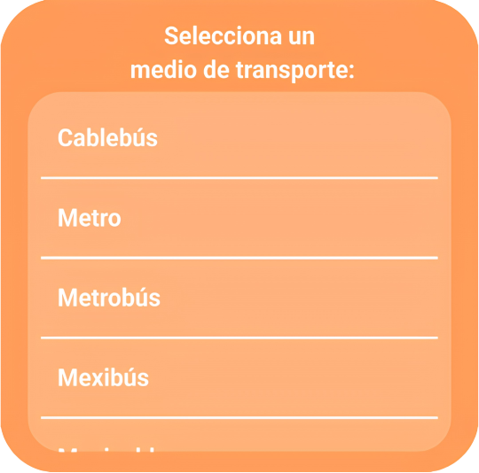
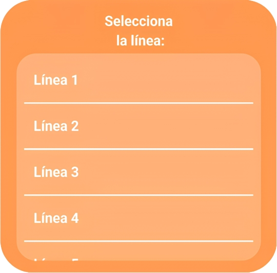
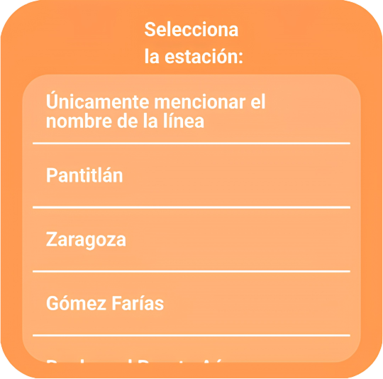
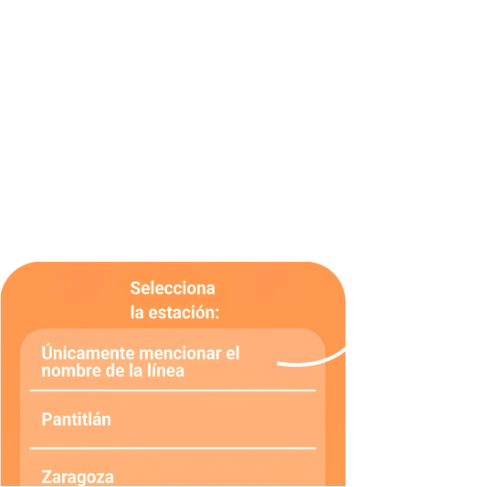
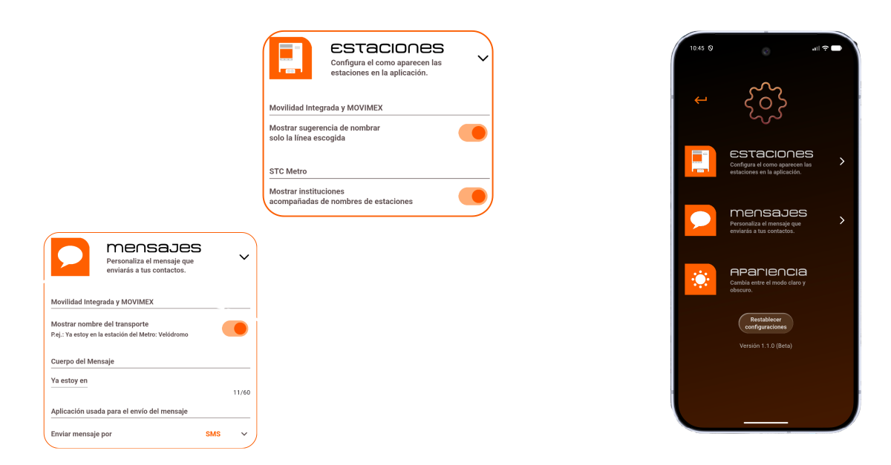

  
   &nbsp;&nbsp;&nbsp;
  

 

# Anuncia mi llegada

Para dispositivos Apple un atajo, en Android una aplicación hecha en Flutter, que permite a usuarios de la red de movilidad integrada de la Ciudad de México y del Estado de México, enviar mensajes de texto de llegada a las estaciones a sus contactos, permitiéndoles personalizar totalmente su mensaje y elegir qué aplicación de mensajería usar.

## ¿Cómo uso la aplicación?

A través de una sola pantalla dinámica, podrás seleccionar el medio de transporte, seguido de la línea y, por último, la estación en la que te encuentras

 

  
  &nbsp;&nbsp;&nbsp;
  
  &nbsp;&nbsp;&nbsp;
  

 

Tu eliges la aplicación de mensajería predeterminada, ya sea: SMS (ideal para zonas subterráneas o con díficil acceso al internet) o WhatsApp.

* **Ajustes y Personalización:** En el menú de configuraciones, podrás definir el cuerpo del mensaje, el modo de apariencia (Claro/Oscuro) y la visibilidad de los nombres de las instituciones.

* **Envío a un toque:** Al seleccionar la estación, la aplicación construirá tu mensaje y abrirá la plataforma de mensajería externa con el texto listo para ser enviado.

  
  &nbsp;&nbsp;&nbsp;
  

 

## ¿Cómo uso el atajo?

El flujo es el mismo, seleccionas el medio de transporte, seguido de la línea y, por último, la estación en la que te encuentras

##  ¿Qué requisitos debo cumplir?

* **Sistema Operativo:** 
Dispositivo móvil con Android.
Dispositivo perteneciente al ecosistema de Apple y sincronizado con tu cuenta de iCloud.
* **Conectividad:** Plan de datos o señal celular (para SMS).
* **Software ajeno:** Contar con una aplicación de gestión de SMS instalada o WhatsApp.

## ¿Cómo la instalo en Android? ( Versión 1.1.1 (Beta) )

1. Dirígete a la sección de **Releases** en el lateral derecho de este repositorio en GitHub.
2. Descarga el archivo `.apk` de la versión `1.1.1-beta` en tu teléfono.
3. Abre el archivo descargado. Si es la primera vez que instalas una app fuera de Google Play, tu dispositivo mostrará una alerta de seguridad. Toca en **Configuración** y activa el permiso de **"Instalar aplicaciones desconocidas"** para tu navegador o gestor de archivos.
4. Toca **Instalar**. ¡Listo! La aplicación ya estará disponible en tu cajón de aplicaciones.

## ¿Cómo guardo el Atajo en mi dispositivo Apple? 

1. Presiona el siguiente link: https://www.icloud.com/shortcuts/47921cbb1e584304958e39f4d7d0bcd4
2. Das click en el botón "Obtén atajo"
3. Se te redirigirá a la aplicación de Atajos, posteriormente darás click en "Agregar atajo". ¡Listo!, ya estas listo de anunciar tu llegada
---

> [!IMPORTANT]
>
> EL USO DE INTELIGENCIA ARTIFICIAL SE LIMITÓ AL CÓDIGO, NO PARTICIPÓ EN OTRO ASPECTO DEL DESARROLLO.
>
>A continuación se mostrará: El modelo utilizado, sesiones que hubieron, fechas, prompts, cambios que realizó y  como es que funcionan dentro de la aplicación

## Uso de Inteligencia Artificial

### Modelo utilizado

Se utilizó el modelo **opencode/big-pickle** a través de la herramienta **opencode** (CLI de asistencia de desarrollo con IA) para el diseño arquitectónico y la implementación de funcionalidades de la aplicación "Anuncia mi llegada".

### Registro de cambios y prompts

#### Primera sesión — 20 de agosto de 2026

**Prompt enviado (resumen):**
> "Continuando con el desarrollo de mi aplicación. Ya se encuentra la lógica de parseo de archivos JSON en mi_repository.dart que devuelve una lista de objetos TransportsModel (que a su vez contienen listas de LinesModel definidas en mi_model.dart). También tengo configurado go_router en mi archivo de rutas y un widget UI reutilizable llamado SelectorWidget que recibe selectorsTitle y listContent.
> Tarea 1: Actualización del Router — Agrega dos nuevas rutas de go_router: una ruta /lineas (cuyo nombre sea LineScreen.name) que reciba un objeto TransportsModel mediante el extra, y una ruta /estaciones (cuyo nombre sea StationsScreen.name) que reciba un objeto LinesModel mediante el extra.
> Tarea 2: Integración de la UI — Modifica mi TransportsScreen con un FutureBuilder que llame a MiRepository().loadTransports(), crea LineScreen y StationsScreen con navegación entre ellas.
> Tarea 3: Documentación — Crea una sección AI Usage en el README.md."

**Cambios realizados:**
- Se crearon las pantallas `LinesScreen` y `StationsScreen` con navegación vía `go_router`.
- Se modificó `TransportsScreen` para integrar `FutureBuilder` con `MiRepository`.
- Se agregaron rutas `/lineas` y `/estaciones` en `app_router.dart`.
- Se actualizó el barrel file `screens.dart`.
- Se movieron `mi_model.dart` y `mi_repository.dart` de `assets/data/` a `lib/data/` para que las importaciones Dart funcionaran correctamente (los archivos en `assets/` no son importables desde `lib/` en Flutter).
- Se creó la sección "AI Usage" en el README.

#### Segunda sesión — 20 de agosto de 2026

**Prompt enviado (resumen):**
> "Haz estas configuraciones en los selector widget: El listContent que tienen debe de estar con opacidad de 1, no debe de ser afectado por el valor de opacidad del Glass Container. El font que debe de tener el texto que se muestra es 'Nunito', con un tamaño de 17, letterSpacing de 0, fontWeight: FontWeight.w700, color: Colors.white. El espacio entre cada elemento debe ser de 0.7, el Divider debe ser de color blanco, con thickness de 5. Para cada Selector Widget alterno al de Transports Screen: el Orange Container debe tener un ancho acorde al Glass Container dejando 20px de espacio en los lados (configurable), la altura no cambia. El Glass Container debe tener un ancho acorde al espacio de los elementos del listContent con 5px de espacio en cada lado (configurable). El divider debe tener anchura igual al tamaño del listContent menos 9 (configurable). Activa el efecto de rebote para el scroll en Android. Redacta en el apartado de AI Usage los cambios, cómo funcionan, el prompt exacto y la fecha."

**Cambios realizados:**

1. **Refactorización de `SelectorWidget` — Separación de capas de opacidad:**
   - El contenedor de vidrio (glass container) y el contenido del listado ahora son dos widgets `Positioned` hermanos dentro del `Stack`, en lugar de estar anidados.
   - El glass container mantiene su `Opacity(opacity: 0.38)` para el efecto visual de vidrio esmerilado.
   - El contenido del listado se renderiza con opacidad 1.0, fuera de la capa de `Opacity` del glass. Esto permite que el texto y los elementos interactivos se muestren con nitidez total sin verse afectados por la transparencia del fondo.

2. **Cambio de API — de `listContent: Widget?` a `listItems: List<Widget>`:**
   - Anteriormente, `SelectorWidget` recibía un `Widget? listContent` que generalmente era un `ListView.separated` pre-construido. Esto impedía que el widget controlara el scroll physics, el divider o el padding interno.
   - Ahora recibe `List<Widget> listItems` y construye el `ListView.separated` internamente, dando control total sobre:
     - **Scroll physics**: `BouncingScrollPhysics` en Android (efecto de rebote), `ClampingScrollPhysics` en iOS.
     - **Divider**: color blanco, `thickness: 5`, `height: 0.7`, con `indent`/`endIndent` calculados a partir de `dividerWidthModifier`.
     - **Padding interno**: controlado por `listContentPadding` (5px por defecto en cada eje).

3. **Estilo de texto unificado via `DefaultTextStyle`:**
   - Se envuelve el `ListView.separated` en un `DefaultTextStyle` con fuente Nunito, tamaño 17, `fontWeight: w700`, color blanco y `letterSpacing: 0`.
   - Cualquier `Text` dentro de los `listItems` que no tenga un estilo explícito hereda este estilo automáticamente.

4. **Dimensiones dinámicas del contenedor naranja:**
   - El ancho del contenedor naranja ahora se calcula automáticamente: `glassContainerWidth + (orangePadding * 2)`.
   - Para pantallas alternas (Lines, Stations), se puede configurar `glassContainerWidth` según el contenido, y el contenedor naranja se ajusta proporcionalmente.

5. **Divider con ancho configurable:**
   - Cada `Divider` recibe `indent` y `endIndent` iguales a `dividerWidthModifier / 2` (por defecto 4.5px cada lado), reduciendo visualmente la línea del divisor respecto al ancho total del contenido.

6. **Simplificación de pantallas:**
   - `LinesScreen`, `StationsScreen` y `TransportsScreen` ahora solo construyen la lista de `ListTile` y la pasan como `listItems`. Todo el estilo visual (fuente, color, divider, scroll) está centralizado en `SelectorWidget`.

**Cómo funciona en la aplicación:**
Cuando el usuario navega a cualquiera de las tres pantallas de selección, `SelectorWidget` construye un `Stack` con tres capas: el contenedor naranja con degradado y opacidad 0.87, el contenedor de vidrio con opacidad 0.38, y el listado con opacidad 1.0. El listado usa `ListView.separated` con `BouncingScrollPhysics` en Android para dar sensación de rebote al hacer scroll. Los dividers entre elementos son blancos con un grosor de 5px y una separación vertical de 0.7px. El texto hereda el estilo Nunito 17/w700/blanco del `DefaultTextStyle`. Para las pantallas de líneas y estaciones, el ancho del contenedor de vidrio puede configurarse para adaptarse al contenido, y el contenedor naranja se expande automáticamente con 20px de margen en cada lado.

#### Tercera sesión — 20 de agosto de 2026

**Prompt enviado (resumen):**
> "Agrega una ScrollBar funcional (que también haga scroll si se presiona) y colócala en el espacio que se dejó en el lado derecho entre el Orange y el Glass Container. Haz transparente el highlightColor y splashColor de los elementos del listContent. Bloquea la orientación de la aplicación a solo Vertical. Agrega estos cambios, su funcionamiento y prompt exacto en el README."

**Cambios realizados:**

1. **ScrollBar funcional en el `SelectorWidget`:**
   - Se envolvió el `ListView.separated` con un widget `Scrollbar` con `thumbVisibility: true` y `trackVisibility: true`.
   - El scrollbar se posiciona visualmente en el espacio derecho entre el contenedor naranja y el de vidrio (el área de `orangePadding`).
   - Se configuró el tema del scrollbar vía `ScrollbarThemeData`: thumb blanco semitransparente (`alpha: 0.5`), track blanco muy tenue (`alpha: 0.1`), borde transparente, grosor 3px y esquinas redondeadas de 10px.
   - El scrollbar es completamente funcional: al presionar y arrastrar el thumb se desplaza el listado.

2. **HighlightColor y SplashColor transparentes:**
   - Se envolvió el `ListView.separated` en un `Theme` con `splashColor: Colors.transparent` y `highlightColor: Colors.transparent`.
   - Al tocar cualquier `ListTile` del listado, ya no se muestra el efecto de onda (splash) ni el resaltado (highlight) del ink, dando una experiencia visual más limpia.

3. **Orientación bloqueada a vertical:**
   - En `main.dart` se agregó `SystemChrome.setPreferredOrientations([DeviceOrientation.portraitUp, DeviceOrientation.portraitDown])` antes de `runApp()`.
   - La aplicación ahora solo funciona en modo vertical, evitando que la pantalla rote al girar el dispositivo.

#### Cuarta sesión — 21 de agosto de 2026

**Prompt enviado (resumen):**
> "Solamente haz estas tres cosas: -Mueve todo el SettingsView al centro de la pantalla, NO CAMBIES LA POSICIÓN DEL TITLE Y EL SUBTITLE -Haz visibles los SVGAssets y hazlos de tamaño 70px x 70px -Anota estos cambios, su funcionalidad, prompt y fecha en el README"

**Cambios realizados:**

1. **`SettingsView` centrado en pantalla (`settings_screen.dart`):**
   - El `ListView.builder` de `_SettingsView` estaba anclado con `Positioned.fill(top: 300)`, es decir, a una posición fija bajo el engranaje.
   - Ahora se envuelve en `Center` con `Positioned.fill` y el `ListView` usa `shrinkWrap: true` con `padding: EdgeInsets.zero`, de modo que el bloque de los tres ítems se centra vertical y horizontalmente dentro del `Stack`.
   - No se modificó `_CustomListTitle`: las posiciones relativas de `title` y `subtitle` dentro de cada `ListTile` se mantienen intactas.

2. **SVGAssets visibles y a 70x70 px (`settings_items.dart`):**
   - Las rutas de los tres SVG estaban mal escritas (`assets/data/icons/config_icons/*.svg`), lo que lanzaba `Unable to load asset` y cerraba la app al navegar a settings; se corrigieron a `assets/icons/config_icons/*.svg`.
   - Cada `SvgPicture.asset` ahora recibe `width: 70, height: 70`.

3. **Documentación en README:** esta misma sección con los cambios, su funcionamiento, el prompt y la fecha.

**Cómo funciona en la aplicación:**
Al navegar a `/settings`, el `Stack` del `Scaffold` renderiza el engranaje y el botón de regreso en sus posiciones originales, y debajo `_SettingsView` ocupa toda la pantalla pero centra su contenido: el `ListView.builder` con `shrinkWrap` mide su altura real (tres `ListTile`) y `Center` lo coloca en el punto medio de la pantalla. Los iconos SVG de Estaciones, Mensajes y Apariencia cargan desde `assets/icons/config_icons/` (ruta registrada en `pubspec.yaml`) y se muestran con dimensiones fijas de 70x70 px como `leading` de cada elemento.

#### Quinta sesión — 22 de agosto de 2026

**Prompt enviado (resumen):**
> "Implementa el Modo Claro y Oscuro para la aplicación, a partir de lo que ya está hecho en el archivo app_theme.dart, que contiene las constantes de diseño para cada componente que va a modificar su color según el modo establecido por el usuario en la configuración de la aplicación, así como los ThemeData para ambos modos. Si te es útil, se encuentra el ValueNotifier<bool> isTrueDarkMode = ValueNotifier(false); que controla el estado global. Deberás hacer que el cambio entre modo claro y oscuro ocurra en una transición suave y fluida mientras se ejecuta la animación de transición de los íconos de light mode y dark mode. El MapIconLight, renómbralo a MapIcon, cambia el path del asset al momento de cambiar entre modos: 'assets/icons/Map_Icon_Dark.png' en oscuro, 'assets/icons/Map_Icon_W.png' en claro. Haz ese mismo trabajo con la imagen del engranaje de settings: 'assets/icons/config_icons/gear_dark.png' en modo oscuro y 'assets/icons/config_icons/gear_white.png' en modo claro. Para el texto dentro del SelectorWidget déjalos con color blanco fijo; únicamente usa el color para la pantalla de configuraciones: Título claro Colors.black / Subtítulo claro Color.fromRGBO(91, 79, 79, 100); Título oscuro Color.fromRGBO(204, 204, 204, 100) / Subtítulo oscuro Color.fromRGBO(151, 145, 145, 100). Agrega esta sesión en el apartado 'Uso de la Inteligencia Artificial', describe qué cambios hiciste, cómo funcionan, el prompt que te di y la fecha."

**Cambios realizados:**

1. **Estado global (`lib/theme/app_theme.dart`):**
   - Se definió `isTrueDarkMode = ValueNotifier(false)` como única fuente de verdad del tema (`true` = modo oscuro).

2. **`main.dart` — transición suave sincronizada con el toggle:**
   - `MaterialApp.router` quedó envuelto en un `ValueListenableBuilder<bool>` escuchando `isTrueDarkMode`.
   - `theme: AppTheme.lightTheme`, `darkTheme: AppTheme.darkTheme`, `themeMode: isDark ? ThemeMode.dark : ThemeMode.light`.
   - `themeAnimationDuration: const Duration(milliseconds: 500)`: al presionar el toggle, la interpolación entre temas dura ~500 ms, acompañando en simultáneo la animación de expansión del icono `LightDarkThemeToggle`.

3. **`SelectorWidget` (`selector_widget.dart`):**
   - Contenedor naranja: `gradient: isDark ? AppTheme.colorsOfOrangeContainerDM : AppTheme.colorsOfOrangeContianerLM`.
   - Contenedor de vidrio: `color: isDark ? AppTheme.colorOfGlassContainerDM : null` y `gradient: isDark ? null : AppTheme.colorOfGlassContainerLM`.
   - Los textos del título y de los `listItems` permanecen SIEMPRE en `Colors.white`.
   - El listado se envolvió en un `Material(type: MaterialType.transparency)`: los `ListTile` pintan su tinta sobre este Material en lugar de quedar silenciados por el `Container` con fondo de cada pantalla (elimina el aviso "ListTile background color or ink splashes may be invisible").

4. **Renombrado `MapIconLight` → `MapIcon` (`map_icon_white.dart` → `map_icon.dart`):**
   - Evalúa `Theme.of(context).brightness` y alterna el asset entre `'assets/icons/Map_Icon_Dark.png'` y `'assets/icons/Map_Icon_W.png'`. Imports y usos actualizados en `TransportsScreen`, `LinesScreen` y `StationsScreen`.

5. **Fondo dinámico en pantallas (`transports`, `lines`, `stations`, `settings`):**
   - Cada `Scaffold` usa `backgroundColor: Colors.transparent` y su `Stack` se envuelve en un `Container` con `BoxDecoration`: `color: isDark ? null : AppTheme.backgroundColorLM` y `gradient: isDark ? AppTheme.backgroundColorDM : null`.

6. **`SettingsScreen`: engranaje dinámico y textos por modo:**
   - El engranaje alterna entre `'assets/icons/config_icons/gear_dark.png'` y `'assets/icons/config_icons/gear_white.png'`.
   - `_CustomListTitle` re-colorea título y subtítulo según el modo mediante un helper `_withColor` que clona cada `Text` conservando su estilo original y sustituyendo solo el color:
     - Claro: título `Colors.black`, subtítulo `Color.fromRGBO(91, 79, 79, 100)`.
     - Oscuro: título `Color.fromRGBO(204, 204, 204, 100)`, subtítulo `Color.fromRGBO(151, 145, 145, 100)`.

7. **Cableado del interruptor de Apariencia (`settings_items.dart`):**
   - `AppearanceIcon` lee `isTrueDarkMode` (`value: !isTrueDark` para que true = claro en el toggle) y escribe directamente `isTrueDarkMode.value = !value`; el tap sobre la fila del ítem hace lo mismo. Al existir un único notificador no puede haber desincronización.

**Cómo funciona en la aplicación:**
El usuario entra a Ajustes y acciona el interruptor de Apariencia (o toca la fila). Eso muta `isTrueDarkMode`; el `ValueListenableBuilder` de `main.dart` reconstruye `MaterialApp.router` con el `themeMode` opuesto y Flutter interpola ambos `ThemeData` durante 500 ms, logrando una transición gradual que ocurre mientras el icono del toggle termina su animación. Todos los widgets dependientes recalculan `isDark = Theme.of(context).brightness == Brightness.dark` y conmutan sus decoraciones: fondo blanco ↔ degradado diagonal oscuro, naranja tenue ↔ naranja intenso, vidrio degradado ↔ vidrio sólido translúcido, e iconos de mapa y engranaje entre sus versiones clara y oscura sin moverse de su posición.

**Resolución de incidencia y refinamientos (misma sesión):**

1. **Incidencia reportada:** al probar en el dispositivo físico, presionar el interruptor de Apariencia no producía ningún cambio visual, ni siquiera después de un reinicio completo de la aplicación.

2. **Diagnóstico:** se auditó el cableado completo (notificador, `AppearanceIcon`, pantallas y widgets) y hasta el código fuente del paquete `light_dark_theme_toggle 1.1.2`, que resultó ser un `IconButton` controlado estándar sin estado interno que pudiera desincronizarse. Una prueba automatizada de extremo a extremo que reproduce la ruta exacta del usuario (botón de configuración → interruptor → verificación visual de fondo, engranaje y colores de texto) pasó íntegra, demostrando que el código era correcto. La causa real fue ejecutar en el dispositivo una compilación antigua: "reiniciar la app" solo relanza el binario instalado y no recompila. La solución fue `flutter clean && flutter pub get && flutter run`.

3. **Blindaje de arquitectura:** se eliminó la dependencia de `Theme.of(context).brightness`; ahora cada componente dinámico (fondos de pantalla, `SelectorWidget`, `MapIcon`, engranaje y textos de ajustes) escucha directamente a `isTrueDarkMode` mediante `ValueListenableBuilder<bool>`. Si el notificador muta, todo cambia de inmediato y sin intermediarios.

4. **Prueba de regresión permanente (`test/theme_visual_test.dart`):** dos tests visuales que navegan por la interfaz real. Detalles técnicos relevantes: se fija un viewport tipo teléfono porque el `SettingsButton` vive en `top: 760` (fuera del lienzo por defecto de los tests); se usa `tester.runAsync` para que el `FutureBuilder` de transportes resuelva la carga del JSON desde `rootBundle`; y se restablece el `GoRouter` global y el notificador entre tests para evitar contaminación de estado.

5. **Transición gradual tipo iOS:** todos los cambios visuales ahora se interpolan durante exactamente los mismos 500 ms que dura la animación del toggle: `AnimatedContainer` (500 ms, `Curves.easeInOut`) en los fondos de las cuatro pantallas y en los contenedores naranja y de vidrio del `SelectorWidget`; `AnimatedSwitcher` con cross-fade para el engranaje y el ícono de mapa; y `TweenAnimationBuilder<Color>` para el color de los textos de ajustes y del botón de retroceso.

6. **`ReturnButton` dinámico:** antes mantenía su color estático ante el cambio de modo; ahora alterna entre azul claro `Color.fromRGBO(113, 203, 248, 100)` en modo claro y azul oscuro `Color.fromRGBO(13, 97, 255, 30)` en modo oscuro, con transición gradual de 500 ms.

#### Sexta sesión — 23 de agosto de 2026

**Prompts enviados (resumen):**
> "Logra un diseño simétrico, parejo entre widgets, en las pantallas de transports/lines/stations. Con los elementos: MapIcon, Selector Widget, Return Button, Settings Button."
>
> "Arregla la resolución de las pantallas… hay una barra negra que desplaza los elementos en el Pixel 4a en el que estoy emulando la app." / "La barra está en un costado; splash y settings están normales."
>
> "Corrige que el Return Button va arriba del Settings Button, igual en el centro y simétrico."
>
> "Cambia el color del ícono de Icons.arrow_forward_ios_rounded a negro si es modo claro y blanco si es modo oscuro."
>
> "Haz que exista solo una pantalla que contenga todos los selectores. El primer selector será el de transportes; después de seleccionar uno, en la misma pantalla el selector cambia a mostrar las líneas y aparecerá el ReturnButton; al seleccionar línea, mostrará las estaciones. El ReturnButton retrocederá al paso anterior (estaciones → líneas → transportes). Como el selector cambia de posición en Y al introducirse el ReturnButton, haz que el selector tenga la misma localización en Y desde el inicio."
>
> "Al presionarlo debe retroceder a la lista anterior: si estaba escogiendo una estación regresa a escoger línea, y si lo vuelve a presionar regresa a escoger transporte público."
>
> "Al cambiar de selector la animación debe ser suave, fluida y que haga que los nuevos elementos aparezcan como un abrir y cerrar de ojos; igualmente, cuando aparezca el ReturnButton debe haber una animación de aparición suave, fluida y corta."
>
> "Explica qué es 'unhandled element <filter/>; Picture key: Svg loader'… estamos por acabar el desarrollo, así que necesitamos arreglarlo para que la app quede limpia."

**Cambios realizados:**

1. **Layout simétrico compartido (`selector_screen_layout.dart`, nuevo):**
   - Composición idéntica para las pantallas de selección: `SafeArea` → `Column` con cuatro `Spacer` equitativos; `MapIcon` arriba centrado, `SelectorWidget` al centro exacto y bloque inferior con `ReturnButton` apilado sobre `SettingsButton`.
   - Todo centrado en el eje horizontal (simetría especular) y ritmo vertical parejo mediante Spacers en lugar de píxeles fijos, por lo que escala igual en cualquier dispositivo.
   - Los widgets compartidos (`MapIcon`, `SettingsButton`, `ReturnButton`) dejaron de auto-posicionarse con `Positioned`; son contenido puro reutilizable. Esto corrigió además un bug por el cual el `SettingsButton` se estiraba a todo el ancho de la pantalla.

2. **Pantalla única de selección por pasos (`selector_screen.dart`):**
   - Máquina de estados `_SelectorStep { transports, lines, stations }`: al elegir transporte se muestra el selector de líneas en la misma pantalla; al elegir línea, el de estaciones.
   - `_goBack()` retrocede un paso: estaciones → líneas → transportes; en transportes el botón no se muestra.
   - El `Future` de `MiRepository().loadTransports()` se crea una sola vez en `initState()`, evitando recargas al reconstruir.
   - Título dinámico por paso ("Selecciona un medio de transporte:" / "la línea:" / "la estación:") con cross-fade vía `AnimatedSwitcher`.
   - Rutas `/lineas` y `/estaciones` eliminadas de `app_router.dart`; ya no existe navegación entre pantallas durante la selección.

3. **ReturnButton con posición estable del selector:**
   - Su espacio queda reservado siempre (antes `Visibility.maintainSize`, hoy `IgnorePointer` + opacidad animada), de modo que el selector NO se mueve en el eje Y nunca, esté visible o no. Verificado por píxeles: borde superior del contenedor naranja idéntico con y sin botón.

4. **Animaciones suaves:**
   - Transición entre selectores: `AnimatedSwitcher` de 350 ms (`easeOut`/`easeIn`) con fade y micro-deslizamiento vertical (3%).
   - Aparición escalonada de elementos: `_StaggeredFadeIn` envuelve cada `ListTile` con un fade-in de 300 ms y retardo incremental (8% por índice, tope 60%), logrando el efecto "abrir y cerrar de ojos" en cascada.
   - Aparición/desaparición del ReturnButton: `AnimatedOpacity` de 300 ms `easeInOut`.

5. **Ícono de flecha en ajustes:** `Icons.arrow_forward_ios_rounded` ahora es negro en modo claro y blanco en modo oscuro.

6. **Limpieza de assets SVG:** eliminados los elementos `<filter>` (definiciones `feColorMatrix` heredadas del export de Figma) y sus referencias en `assets/images/appcard.svg` e `assets/icons/icon.svg`. Elimina por completo el warning `unhandled element <filter/>` de flutter_svg sin alterar el render (comparación de screenshots: ~0% de diferencia).

7. **Tests actualizados:** `theme_visual_test.dart` valida la alternancia del ReturnButton con sus colores actuales (naranja claro `(255,186,130)` / café oscuro `(73,46,25,0.925)`).

**Resolución de incidencia (franja negra lateral):**
Durante la emulación en Pixel 4a se reportó una banda negra lateral que desplazaba el contenido. Diagnóstico por captura de píxeles vía adb: Flutter maquetaba correctamente (constraints de ancho completo verificados con sondas `LayoutBuilder`), pero la superficie quedaba recortada ~260 px. Bisect de compilaciones determinó que el disparador fue eliminar el `Center` exterior del `SelectorWidget`: esa estructura, combinada con los `BackdropFilter` del selector, evita un bug de composición del emulador API 36. Se restauró el `Center` original y el problema desapareció definitivamente.

**Cómo funciona en la aplicación:**
El usuario aterriza directamente en el selector de transportes. Al picar uno, el mismo selector hace un cross-fade de 350 ms hacia la lista de líneas cuyos elementos aparecen en cascada, mientras el botón "Retroceder" se desvanece suavemente sobre el engranaje de ajustes. Al elegir línea, ocurre lo mismo hacia estaciones. Cada pulsación de "Retroceder" deshace un paso regresando al selector anterior con las mismas animaciones, y el selector jamás salta de posición vertical porque su hueco inferior está reservado desde el inicio.

#### Séptima sesión — 2 de septiembre de 2026

**Prompts enviados (resumen):**
> "Configura lo necesario para que todas las implementaciones en la app del font del Metro DF, tengan las mismas características del metroStyle del settingsItem, pero con el color hardcodeado: F69346. No importa si es modo claro u obscuro, quiero que cada vez que coloque la variable metroStyle, el texto tenga esas características."
>
> "Resuelve el porque no cambia de color en este momento que se ejecuta la app, aun cerrando la debug session y abriendola."
>
> "Haz que el MapIcon siempre se encuentre en la misma posición en pantalla que el gear.png de la settings screen."
>
> "Arregla la pantalla de los selectores, el mapIcon debe permanecer en la posición del png de gear de la settingsScreen y el selectorWidget en medio."
>
> "Regresa el settingsButton y el botón de retroceder a la posición en la que estaban anteriormente a que cambiarás todo esto."
>
> "Vale, elimina el cambio que hiciste en los botones de settings y el de return, únicamente colócalos fijamente en la posición x,y en la que se encontraban en pantalla el momento antes de que incluyeras el selector_screen_layout."
>
> "Okay, ahora inserta el backgroundColor que ya tengo hecho de mi app theme a mi pantalla record_screen."
>
> "Implementa el record_button a mi pantalla de selectorsScreen, colócalo en las mismas coordenadas del keyboard_return IconButton de mi settings Screen."
>
> "Arregla los nuevos SVGs agregados en la carpeta de record_icons, y además, verifica la implementación del recordButton en la pantalla de selectorsScreen, no debe encontrarse este botón en ningún otra pantalla."
>
> "Arregla estos errores: [Unable to load asset: 'assets/icons/record_icons/record_button_dark.svg']"

**Cambios realizados:**

1. **`metroStyle` del Metro DF centralizado y hardcodeado (`lib/theme/app_theme.dart` + `lib/config/menu/settings_items.dart`):**
   - Se creó la constante `AppTheme.metroStyle` con `fontFamily: 'METRO-DF'`, `fontSize: 24` y `color: Color(0xFFF69346)` (naranja) fijo, sin depender del tema.
   - Se eliminó la constante local duplicada en `settings_items.dart`; los tres títulos del menú ("Apariencia", "Estaciones", "Mensajes") usan ahora `AppTheme.metroStyle`.
   - El título "Apariencia" antes se declaraba con `TextStyle(fontFamily: 'METRO-DF', fontSize: 24)` **sin color**, por lo que no tenía el naranja; ahora lo hereda de `AppTheme.metroStyle`.

2. **Por qué "no cambiaba de color" y su solución (`lib/presentation/screens/settings/settings_screen.dart`):**
   - Causa raíz: el helper `_withColor` clonaba cada `Text` con `baseStyle.copyWith(color: titleColor)` donde `titleColor` era el color del tema (negro/gris). Eso **pisaba** el naranja hardcodeado del `metroStyle` con el color del modo claro/obscuro.
   - Solución: `_withColor` ahora calcula `effectiveColor = baseStyle.color ?? fallbackColor`. Si el estilo trae color propio (el caso de `metroStyle`), lo respeta siempre; solo en textos sin color (los subtítulos en `_nunitoFamily`) aplica el color del tema. Así el naranja `F69346` se mantiene en ambos modos.
   - Se retiró el `TweenAnimationBuilder` que envolvía a cada texto: su `ColorTween` era constante (`begin = end`), así que no existía animación real que preservar.

3. **MapIcon fijo en la posición del engranaje (`lib/presentation/widgets/shared/selector_screen_layout.dart`):**
   - En la settings screen el engranaje vive en `Positioned(left: 0, right: 0, top: 108)` centrado. El `MapIcon` pasó a ocupar exactamente ese mismo `Positioned`, por lo que permanece siempre en la misma coordenada de pantalla y no "salta" al navegar entre la pantalla de selectores y la de ajustes.

4. **Selector centrado y botones en sus posiciones fijas originales (`selector_screen_layout.dart`):**
   - El `SelectorWidget` quedó centrado en el medio de la pantalla (`Positioned.fill` → `SafeArea` → `Center`), garantizando la misma localización en el eje Y sin importar el contenido.
   - Los botones recuperaron las coordenadas exactas que tenían **antes** de existir el layout unificado (recuperadas del historial git, commit previo a `8431065`): `ReturnButton` en `Positioned(left: 0, right: 0, top: 690)` centrado y `SettingsButton` en `Positioned(left: 0, right: 0, top: 760)` centrado.
   - El `ReturnButton` conserva su comportamiento de ocultarse en el primer paso mediante `IgnorePointer` + `AnimatedOpacity` (según `showReturnButton`).

5. **Fondo temático en `record_screen` (`lib/presentation/screens/record_screen/record_screen.dart`):**
   - Se sustituyó el color fijo `Color(0xFFF26400)` por el mismo patrón del resto de pantallas: `Scaffold` transparente + `ValueListenableBuilder<bool>` sobre `isTrueDarkMode` + `AnimatedContainer` cuyos `BoxDecoration` usan `AppTheme.backgroundColorLM` (blanco) en claro y `AppTheme.backgroundColorDM` (degradado oscuro) en obscuro, con transición de 500 ms.
   - Nota: durante un hot reload el archivo quedó corrupto (`backgroundColor:` sin valor); se reescribió completo y el análisis de Dart quedó limpio.

6. **RecordButton en la pantalla de selectores (`selector_screen_layout.dart` + `lib/presentation/widgets/shared/buttons/record_button.dart`):**
   - Se agregó el `RecordButton` al `Stack` del layout de selectores con las mismas coordenadas del icono de retorno de la settings screen: `Positioned(left: 28, top: 126)` (la referencia exacta vive en `settings_screen.dart`, `Positioned(left: 28, top: 126)` del `Icon(Icons.keyboard_return_outlined)`).
   - El botón navega a `RecordScreen.name`, es de 48×48 y conmuta su SVG según el modo.
   - Dónde se configuran estos valores: la **fuente de verdad** de la posición es `lib/presentation/screens/settings/settings_screen.dart` (líneas del `Positioned`), y el **valor que debe copiarse** para esta pantalla es el `Positioned(left: 28, top: 126)` en `lib/presentation/widgets/shared/selector_screen_layout.dart`. Si en el futuro se mueve el botón en una pantalla, hay que replicar el cambio en la otra coordinarmente (o extraer una constante compartida).

7. **Corrección de SVGs en `assets/icons/record_icons/`:**
   - El `RecordButton` cargaba `record_icon.svg` y `record_icon_dark.svg`, dos SVGs grandes (109×109) con degradados `#F8AC72→#FEB7C4` fuera de la paleta de la app.
   - Se renombró `record_book_dark.svg` → `record_button_dark.svg` para que la pareja sea consistente con la convención `settings_Icon` / `settings_Icon_dark`, y `record_button.dart` ahora usa los SVGs correctos de 24×24 con color plano: `record_button.svg` (#F8AC71) en claro y `record_button_dark.svg` (#FF6F00) en obscuro.
   - Se verificó que el `RecordButton` únicamente se instancia en la pantalla de selectores (`selector_screen_layout.dart`, usado solo por `selector_screen.dart`); no existe en ninguna otra pantalla. `record_icon.svg` y `record_icon_dark.svg` quedaron sin referencias, listos para usarse (o eliminarse) en el futuro de la `RecordScreen`.

8. **Error "Unable to load asset: record_button_dark.svg" (`pubspec.yaml`):**
   - Causa raíz: la sección `flutter: assets:` del `pubspec.yaml` declaraba `assets/icons/` y `assets/icons/config_icons/` pero **no** `assets/icons/record_icons/`; como Flutter solo empaqueta directorios declarados explícitamente (no incluye subcarpetas automáticamente), los SVGs nuevos nunca llegaban al bundle.
   - Solución: se agregó `- assets/icons/record_icons/` a la lista de assets; tras `flutter pub get` y una compilación completa (no hot reload) el asset carga correctamente.

**Explicaciones solicitadas por el usuario (sin cambios de código):**
- **fallbackColor:** es el color de respaldo que se usa **solo** cuando un `TextStyle` no define color propio; en `_withColor`, `baseStyle.color ?? fallbackColor` significa "usar el color que trae el estilo y, si no trae, usar el del tema".
- **Descripción completa de `selector_screen_layout.dart`:** el archivo es el layout compartido de las pantallas de selección; su `build` regresa un `Stack` de capas: (1) `MapIcon` fijo en `top: 108` igual que el engranaje de settings, (2) el `SelectorWidget` centrado vía `Positioned.fill` + `SafeArea` + `Center`, y (3) los botones fijos `ReturnButton` en `top: 690` y `SettingsButton` en `top: 760`. Los parámetros `selector`, `showReturnButton` y `onReturnTap` permiten que las pantallas móviles inyecten su contenido y controlen el botón de retroceso.

**Cómo funciona en la aplicación:**
En los selectores, el icono del mapa queda clavado en la misma coordenada que el engranaje de ajustes (`top: 108`, centrado) y el selector de transportes/líneas/estaciones queda siempre al centro de la pantalla, mientras "Retroceder" y el engranaje se mantienen en `top: 690` y `top: 760` como en el diseño original. En los ajustes, los títulos del Metro DF lucen el naranja `F69346` fijo en cualquier modo porque `_withColor` respeta el color propio de `metroStyle` y solo aplica el color del tema como respaldo. La pantalla de grabar (~record screen) muestra el fondo claro/obscuro del tema con transición suave. Arriba a la izquierda de los selectores aparece el botón de grabación, en las mismas coordenadas (`left: 28, top: 126`) que el icono de retorno de los ajustes, navegando a `RecordScreen`; su icono es un SVG plano de 24×24 (`#F8AC71` claro / `#FF6F00` obscuro) declarado correctamente en `pubspec.yaml` para que cargue en el bundle.

#### Octava sesión — 3 de septiembre de 2026

**Prompt enviado (resumen):**
> "Haz que si se presiona un elemento del historial (record), te rediriga a la app que este como predeterminada, para mandar de nuevo el mensaje. Y haz que esos cambios esten en el dispositivo."

**Cambios realizados:**

1. **Reenvío del mensaje al tocar un registro del historial (`lib/presentation/screens/record_screen/record_screen.dart`):**
   - Se importaron `url_launcher` y `share_plus` para reutilizar el mismo mecanismo de envío que la pantalla de selectores.
   - Nueva función `_resendMessage(RecordItems record)`: reconstruye la cadena final con el cuerpo del mensaje de preferencias y el nombre de la estación o línea guardado (`'$messageBody ${record.stationName}'`) y abre la aplicación de mensajería predeterminada configurada.
     - Si la app predeterminada es **WhatsApp**: lanza `whatsapp://send?text=...` con el texto codificado.
     - Si es **Otros**: usa el `SharePlus` (recuadro del sistema).
     - Si es **SMS** (predeterminado de fábrica): lanza `sms:?body=...`.
   - Cada elemento del historial se envolvió en un `Material` transparente + `InkWell` (con `borderRadius: 12`) cuyo `onTap` invoca `_resendMessage(record)`, agregando además el efecto de onda al presionar.

**Cómo funciona en la aplicación:**
En la pantalla de historial, al tocar cualquiera de los registros la aplicación reutiliza el cuerpo de mensaje guardado en ajustes junto con la estación o línea de ese registro y abre la aplicación de mensajería que el usuario dejó como predeterminada (SMS, WhatsApp o el recuadro de compartir), con el texto ya redactado listo para reenviar el mismo anuncio sin volver a recorrer los selectores.

#### Décima sesión — 13 de septiembre de 2026

**Prompts enviados (resumen):**
> "Guíame para crear un token de Mapbox, cómo protegerlo en un repositorio público, mover los cambios de la rama experimental a develop y eliminar experimental; implementa el mapa de Mapbox con mi token, protégelo a nivel de código y reporta todos los cambios por archivo contra develop; después implementa la barra de búsqueda"
>
> "La barra de búsqueda no muestra sugerencias al escribir una dirección; haz que las nuevas implementaciones funcionen perfectamente en Android (APK futuro y emulador)"
>
> "Al ejecutar la app desde main.dart, al ir al mapa crashea con PlatformException (MapboxConfigurationException)"
>
> "En el buscador aparece 'Falta configurar el token de Mapbox (mapbox.env)'"
>
> "Haz que todo esté listo para ambas plataformas"

**Cambios realizados:**

1. **Migración del mapa de OpenStreetMap a Mapbox (`lib/presentation/screens/selectors/custom_location/map_screen.dart`):**
   - Se sustituyó el widget de mapa anterior por `MapWidget` de `mapbox_maps_flutter` con el estilo `MapboxStyles.STANDARD`.
   - El mapa se centra en la ubicación actual del usuario (con geolocalización) o, si no se puede obtener, en un punto por defecto de la Ciudad de México.
   - Se conserva el ícono central de tipo "marcador" y el botón "Confirmar ubicación", que devuelve la latitud/longitud del centro del mapa a la pantalla anterior.

2. **Módulo de geocoding con Mapbox (`lib/config/mapbox_geocoding.dart`, nuevo):**
   - `forwardGeocode(query)`: busca direcciones/lugares por texto (hasta 5 resultados, con `language=es` y opción de `proximity`) y los devuelve como `MapboxPlace` (nombre + latitud/longitud).
   - `reverseGeocode(lat, lng)`: convierte coordenadas en una dirección legible (barrio + asentamiento), usada para mostrar un texto comprensible en el mensaje.

3. **Barra de búsqueda de lugares (`map_screen.dart`):**
   - Campo de texto flotante sobre el mapa con debounce de 500 ms (no hace llamadas por cada tecla).
   - Muestra el spinner mientras busca y una lista de hasta 5 sugerencias; al tocar una sugerencia, el mapa vuela (`flyTo`) al lugar.
   - Si no hay resultado o el token no está configurado, muestra avisos amigables en lugar de crashear: "Falta configurar el token de Mapbox (mapbox.env)" o "No se encontraron resultados".

4. **Dirección legible en la ubicación personalizada (`lib/config/menu/custom_location_items.dart`):**
   - "UBICAR EN EL MAPA" y "USAR UBICACIÓN ACTUAL" ahora usan el `reverseGeocode` compartido: si se resuelve la dirección, el mensaje enviado incluye el nombre del lugar en vez de coordenadas crudas.

5. **Ramas:**
   - Los cambios se movieron de la rama experimental a develop (merge fast-forward) y la rama experimental se eliminó.

6. **Inyección del token en compilación (`lib/config/mapbox_config.dart`, `lib/main.dart`):**
   - El token se lee con `String.fromEnvironment` y se inyecta en compilación con `--dart-define-from-file`, desde un archivo de entorno local incluido en `.gitignore` (con su plantilla `.example` versionada, sin valor).
   - Se añadió `build_apk.sh` (genera el APK release con el token inyectado) y configuraciones de ejecución en `.vscode/launch.json` y `.vscode/settings.json` (`dart.flutterRunAdditionalArgs`) para que las ejecuciones desde `main.dart` lleven el token automáticamente.
   - `main.dart` resuelve el token (del define o del canal nativo) antes de llamar a `MapboxOptions.setAccessToken`.

7. **Compatibilidad de build con Android (`android/gradle.properties`, `android/app/build.gradle.kts`, `MainActivity.kt`):**
   - Se activó `android.builtInKotlin=true` porque el plugin `mapbox_maps_flutter 2.30.1` requiere Built-in Kotlin con AGP 9 ("Could not find method kotlin()").
   - El token de acceso público se expone al SDK nativo de Android a través de un recurso local (`mapbox_access_token`) que vive en un archivo en `.gitignore`.
   - `MainActivity.kt` registra un canal nativo (`rmdeveloper/mapbox_access_token`) que devuelve el token a Dart, de modo que la app funciona también al ejecutarse desde `main.dart` sin `--dart-define` (Android Studio, terminal o Android con ejecutables predeterminados).

8. **Compatibilidad de build con iOS (`ios/Flutter/Debug.xcconfig`, `ios/Flutter/Release.xcconfig`, `ios/Runner/Info.plist`, `ios/Runner/AppDelegate.swift`):**
   - Se añadió un archivo de configuración local (en `.gitignore`) con el token y se enlazó de forma opcional desde los `.xcconfig` de Flutter.
   - La clave `MGLMapboxAccessToken` de `Info.plist` se sustituye con ese valor, por lo que el SDK nativo de Mapbox tiene el token aun sin `--dart-define`.
   - `AppDelegate.swift` registra el mismo canal nativo para que Dart obtenga el token y el buscador funcione igual en iOS.
   - Se verificó `flutter build ios --debug --simulator` y el arranque de la app en el simulador de iPhone con el SDK de Mapbox inicializado.

**Cómo funciona en la aplicación:**
Al elegir "Usar ubicación personalizada" → "UBICAR EN EL MAPA" se abre el mapa de Mapbox centrado en la ubicación del usuario (o en la Ciudad de México si no hay permiso). Al escribir en el buscador, la app sugiere hasta 5 lugares reales de Mapbox; al tocar uno, el mapa se desplaza hasta ese punto. Con "Confirmar ubicación" el centro del mapa se convierte en una dirección legible (reversa) que se envía junto con el cuerpo del mensaje de ajustes. La opción "Usar ubicación actual" hace lo mismo con las coordenadas del GPS. Todo esto funciona en Android e iOS tanto al ejecutarse desde `main.dart` (VS Code, Android Studio o terminal) como en el APK compilado, porque el token público se inyecta de forma segura en cada plataforma y nunca se sube al repositorio.

#### Novena sesión — 4 de septiembre de 2026

**Prompts enviados (resumen):**
> "Arregla todos los errores, incluyendo el de Metrobús. Haz todo lo posible, pero haz que en la barra de categorías: la categoría METROBÚS siga existiendo y muestre las estaciones del metrobús que eligio el usuario, y el mismo caso con TRENES V.M, debe de mostrar las estaciones de los Trenes del Valle de México, y en la barra de categorías debe de mostrarse como TRENES V.M"
>
> "Implementa el que en la barra de categorías, a lado de TODOS debe de haber un paréntesis que contenga el número de todos los elementos del historial. Debe de verse así: 'TODOS (n)... | ... '"

**Cambios realizados:**

1. **Arreglo del bug de categorías en el historial (`lib/presentation/screens/selectors/selector_screen/selector_screen.dart`):**
   - Se reemplazó el cálculo de categoría de la estación `(_transport?.name ?? 'OTROS').toUpperCase().split(' ').first`, que generaba categorías incorrectas, por una función explícita `_transportCategory()` que mapea cada transporte a su categoría exacta tal y como aparece en la barra de categorías de la pantalla de historial:
     - `Metro` → `METRO`
     - `Metrobús` → `METROBÚS`
     - `Trolebús` → `TROLEBÚS`
     - `Cablebús` → `CABLEBÚS`
     - `Mexibús` → `MEXÍBUS` (con tilde en la Í, igual que el filtro)
     - `Mexicable` → `MEXICABLE`
     - `Tren Ligero` → `TREN LIGERO`
     - `Trenes del Valle de México` → `TRENES V.M`
   - Esto corrige tres transportes que antes no aparecían en su categoría: **Tren Ligero** (guardaba `TREN`), **Mexibús** (guardaba `MEXIBÚS` sin tilde en la Í) y **Trenes del Valle de México** (guardaba `TRENES`).

2. **Comparación exacta en el filtro del historial (`lib/presentation/screens/history_screen/history_screen.dart`):**
   - El filtro de la lista de registros cambió de `item.category.contains(selectCategory)` a `item.category == selectCategory`.
   - Esto elimina el efecto colateral por el cual **Metrobús** también se mostraba bajo la categoría **METRO** (porque "METROBÚS" contiene "METRO"). Ahora cada categoría muestra únicamente los registros que le pertenecen exactamente.
   - La categoría `METROBÚS` sigue existiendo y muestra las estaciones de metrobús elegidas por el usuario, y la categoría `TRENES V.M` sigue existiendo y muestra las estaciones de los Trenes del Valle de México.
   - La opción "Únicamente mencionar el nombre de la línea" se mantiene intacta: guarda `category: 'LÍNEAS'` y muestra el nombre de la línea en el historial.

3. **Contador en la categoría TODOS (`lib/presentation/screens/history_screen/history_screen.dart`):**
   - La barra de categorías se envolvió en un `ValueListenableBuilder<List<HistoryItems>>` que escucha `PreferencesService.historyList`, de modo que el conteo se actualiza en tiempo real al agregar o borrar registros.
   - El ítem "TODOS" ahora muestra el número total de elementos del historial entre paréntesis: `TODOS (n)`.

**Cómo funciona en la aplicación:**
En los selectores, al elegir una estación el registro del historial se guarda con la categoría exacta del transporte al que pertenece (METRO, METROBÚS, TROLEBÚS, CABLEBÚS, MEXÍBUS, MEXICABLE, TREN LIGERO o TRENES V.M). En la pantalla de historial, la barra de categorías filtra cada una de forma exacta: al tocar "METROBÚS" solo se ven estaciones de metrobús (ya no se colan en "METRO") y al tocar "TRENES V.M" solo se ven estaciones de los Trenes del Valle de México. La opción "Únicamente mencionar el nombre de la línea" sigue quedando en la categoría "LÍNEAS". Además, junto a la categoría "TODOS" aparece un paréntesis con el número total de registros guardados (p. ej. "TODOS (7)"), que se actualiza automáticamente cada vez que el usuario envía un nuevo mensaje o borra el historial.

#### Decimoprimera sesión — 27 de septiembre de 2026

**Prompts enviados:**
> "He cambiado en mi aplicación el nombre de una de las opciones de la defaultMessagingApp , pasó de "Otros" a "Cualquier app de mensajería", al hacerlo, mis simuladores al correr se rompián ya que intentaban buscar el valor de "Otros" , esto se solucionaba picando el resetButton, pero quiero pensar en mis usuarios. Haz lo posible para que la app sobrescriba el valor antiguo de "Otros" a "Cualquier app d emensajería"."
>
> "Okay, ahora pasemos a los settings_items, segun tengo entendido los widgets de Cupertino no son como tal excluivos de iOS, tambien se dibujan en Android. Tengo ahorita en mi aplicación el MessageAppSelector, que es un MenuANchor, antes era un DropDownButton, pero a mi parecer ambos no tienen un estilo moderno y sofisticado, por lo que quiero implementar el CupertinoMenuAnchor, por favor haz esta modificación, unicamemtne te pido que todo el código del Menu Anchor actual y del anterior DrpoDownButton lo comentes, no lo borrés por favor."
>
> "Quita esa pildora naranja y su shadow, el selector antes de abrirse debe de verse como un texto normal, con el mismo color del metroStyle, no debe de resaltar tanto."
>
> "Añade un sombreado al pulsar el selector, tal como cpasa con los Inkwell."
>
> "Okay, ahora unicamente añade esta sesión e implementación en el README; en el apartado de "Uso de la IA" , ya sabes, pon fecha, prompts exactos, qué cambios hiciste y cómo es que estos funcionan en la app, luego de que hayas hecho esto, haz commit UNICAMENTE al README, el commit que pondrás será "docs(readme): se agregó una sesión al apartado "Uso de la IA"", aun no harás git push vale."

**Cambios realizados:**

1. **Migración del valor renombrado de la app de mensajería (`lib/config/preferences/preferences_service.dart`):**
   - El valor guardado en `SharedPreferences` **es** el texto visible de la opción (la app no tiene un identificador aparte del label), por eso un renombrado dejaba inservible la preferencia de quien ya había elegido "Otros". Con el texto viejo almacenado, la comparación `preferredApp == "Cualquier app de mensajería"` no coincidía y todos esos usuarios caían en la rama de SMS.
   - Se declararon los valores canónicos en un solo lugar: `messagingAppSms`, `messagingAppWhatsApp` y `messagingAppAny` (`preferences_service.dart:12`), más la lista `messagingAppOptions` (`:17`) que es la única declaración de qué opciones existen.
   - Se agregó el mapa `_legacyMessagingAppValues` (`:25`), que traduce valores de versiones anteriores a su equivalente vigente: `"Otros" → "Cualquier app de mensajería"`. Un próximo renombrado se resuelve agregando una sola línea aquí.
   - Nueva función `resolveMessagingApp(String? value)` (`:74`): aplica la traducción y, si el resultado no está entre las `messagingAppOptions`, cae al valor predeterminado. Esto además protege al `DropdownButton`/`CupertinoMenuAnchor` de fallar si llegara un valor desconocido.
   - `init()` (`:109`) ahora lee la preferencia, la normaliza y **vuelve a escribirla solo si cambió**. Es idempotente: la corrección ocurre una única vez por instalación y el usuario conserva su elección (no se ve obligado a picar el botón de restablecer, que además lo devolvía a SMS).
   - `setDefaultMessagingApp()` (`:155`) también valida antes de guardar, de modo que un error en la UI no pueda persistir un valor basura.
   - Se corrigió además una referencia que se había quedado con el nombre viejo: `history_screen.dart:47` seguía comparando contra `"Otros"`, por lo que el reenvío desde el historial nunca llegaba a la rama de compartir y terminaba en SMS.

2. **Reemplazo del `MenuAnchor` por `CupertinoMenuAnchor` (`lib/config/menu/settings_items.dart`):**
   - `_MessagingAppSelectorState` (`:644`) ahora construye un `CupertinoMenuAnchor` (`:674`) con un `CupertinoMenuItem` por opción: icono a la izquierda, un check naranja (`Icons.check_rounded`) en la opción activa, padding vertical de 12 y el mismo `Nunito` del resto de la sección. El menú se cierra solo al elegir, ya que `requestCloseOnActivate` viene activo por defecto.
   - Se creó la clase privada `_MessagingAppOption` para emparejar cada valor persistido con su icono (`chat_bubble_outline`, `phone`, `ios_share`) y se recorrió esa lista, de modo que el selector no puede desincronizarse de las opciones reales ni del envío del mensaje.
   - **El código anterior se conservó comentado**, tal como se pidió: el `MenuAnchor` (Material) completo y el `DropdownButton` más antiguo siguen en el archivo dentro de bloques de comentario como referencia.

3. **`CupertinoTheme` a nivel de app (`lib/main.dart:43`):**
   - El panel de `CupertinoMenuAnchor` se dibuja en el `Overlay`, que cuelga del `Navigator` y por lo tanto está **fuera** del `Theme` de Material; solo hereda el `MediaQuery`. Sin un `CupertinoTheme` sobre el árbol, el panel se pintaba siempre con los colores del modo claro (fondo traslúcido claro y texto oscuro) aunque la app estuviera en modo oscuro.
   - Se añadió un `builder` en el `MaterialApp.router` que inyecta `CupertinoTheme` con el `brightness` vigente, por lo que el menú (y cualquier otro widget de Cupertino en el futuro) respeta el modo claro/oscuro.

4. **Ancla del selector como texto normal (`settings_items.dart:703`):**
   - Se eliminaron la píldora naranja, su degradado, la sombra, el `Material` de fondo y el `padding` interior: el valor se ve ahora como texto corriente, con el mismo `TextStyle` que el resto de la fila y únicamente el color naranja de `AppTheme.metroStyle` (`0xFFF69346`) leído desde esa constante para no duplicarlo. Se quitó también el `fontWeight: w800` para que no destacara frente al texto vecino.
   - Se conservó el chevron que rota 180° mientras el menú está abierto, que es lo único que indica que el texto es pulsable.

5. **Sombreado al pulsar (`settings_items.dart:706`):**
   - El `GestureDetector` se sustituyó por `Material(type: transparency)` + `InkWell`, con `splashColor` y `highlightColor` derivados del mismo naranja `metroStyle` (12% y 8% respectivamente) y `borderRadius: 12` para que la elipse y el ripple salgan redondeados.
   - El `Material` propio es indispensable: el ancla vive dentro del `InkWell` que el propio `MenuAnchor`/`CupertinoMenuAnchor` usa para abrir el menú, así que sin él la tinta se dibujaría sobre el `Material` transparente de toda la sección de ajustes y el splash aparecería recortado.

6. **Pruebas (`test/preferences_messaging_app_migration_test.dart` y `test/messaging_app_selector_test.dart`, nuevos):**
   - La primera verifica la traducción de "Otros", que los valores vigentes se conservan, y que un valor desconocido o ausente cae al predeterminado.
   - La segunda monta la sección de ajustes real, abre el menú en modo claro y oscuro comprobando que no haya excepciones, y confirma que elegir una opción guarda la preferencia y cierra el menú.

**Cómo funciona en la aplicación:**
El usuario que ya había elegido "Otros" antes del renombrado ya no necesita hacer nada: al abrir la app, `PreferencesService.init()` detecta el valor antiguo, lo traduce a "Cualquier app de mensajería" y lo guarda, de modo que su elección sigue vigente y el envío del mensaje sigue yendo a la app que él había escogido. A partir de ese momento la opción se elige desde un `CupertinoMenuAnchor`: se ve como un texto naranja junto al chevron, al pulsarlo aparece un ripple suave y encima un menú con las tres opciones (SMS, WhatsApp y cualquier app de mensajería) donde la activa tiene un check; al tocar una, el menú se cierra con la animación nativa y la preferencia queda guardada, tanto para enviar desde los selectores como para reenviar un registro del historial. El menú se dibuja sobre un panel translúcido con desenfoque cuyo color se adapta al modo claro u oscuro de la app, porque el `CupertinoTheme` se inyecta en el `MaterialApp` y alcanza también al `Overlay` donde se pinta el panel.

#### Decimosegunda sesión — 29 de septiembre de 2026

**Objetivo de la sesión** (reconstruido a partir del inicio de sesión, que se retomó desde un resumen):
> Ajustar el layout de la pantalla de selección (`SelectorScreenLayout`) para que el selector quede lo más centrado posible, que el botón "Retroceder" tenga una separación simétrica de ~40px arriba y abajo, y que nada se rompa ni se desborde en ningún dispositivo. Verificar en iPhone SE 3 (375x667) y en Pixel 10 Pro (427x952).

**Prompts enviados:**
> "Por favor, haz que el settings button tenga el espacio que antes tenía cuando había un Spacer, pero este cambio como tal no debe de afectar estas implementaciones que hiciste, el selector debe seguir centrado y el botón de reset debe de ser simetrico"

> "Vale, ahora agrega esta sesión en el README en el apartado del "Uso de la IA" , recuerda que debes de poner fecha, prompts exatctos, qué cambios hiciste y como es que estos funcionan, cuando termines harás git commit diciendo "docs(readme): se agregó una nueva sesión en el apartado de "Uso de la IA"" No harás git push aún"

*(La sesión se interrumpió dos veces para pausar el trabajo y se reanudó a petición del usuario, sin que eso cambiara el alcance.)*

**Decisión de diseño tomada durante la sesión** (opción elegida entre varias propuestas sobre cuánto espacio dejar bajo el botón de ajustes): **"Elástico como el Spacer viejo"** — el espacio bajo el settings button vuelve a ser elástico y crece con el espacio que sobra en la pantalla, como el `Spacer` del diseño anterior; el selector conserva su tamaño de diseño y solo se reduce en pantallas cortas.

**Cambios realizados:**

1. **Diagnóstico: por qué el `Spacer` "rotaba" espacio al selector (`lib/presentation/widgets/layouts/selector_screen_layout.dart`):**
   - `RenderFlex` **no reparte** el espacio sobrante entre los hijos flexibles. Ese sobrante se entrega a `mainAxisAlignment` (por defecto `start`, es decir, se queda al final de la pantalla). Por eso un `Spacer()` al final se quedaba con la mitad del espacio libre y el `Expanded` del selector se quedaba sin él: el selector medía 139px en iPhone SE 3 y 264px en Pixel 10 Pro.
   - Se descartó envolver la pantalla en `IntrinsicHeight` + `SingleChildScrollView` porque **`LayoutBuilder` devuelve 0 en los cálculos intrínsecos**: el selector, que se mide con `LayoutBuilder`, habría recibido altura 0 y se habría roto el layout.
   - Se descartó también `MainAxisAlignment.spaceBetween` con el selector dentro de un hijo flexible, porque el sobrante se reparte en **tres** huecos y el selector quedaba descentrado respecto a la pantalla.

2. **Layout final de `SelectorScreenLayout` (`lib/presentation/widgets/layouts/selector_screen_layout.dart`):**
   - Estructura: `SafeArea > Column[ bloque superior, Spacer(flex:1), selector, bloque inferior, Spacer(flex:1) ]`, que es la del diseño original. Los **dos `Spacer` reparten el sobrante 50/50**, de modo que el selector queda centrado entre el ícono del mapa y el botón de retroceder y el botón de ajustes recupera su espacio elástico inferior.
   - El selector **no** es un hijo flexible: es un `SizedBox` con la altura calculada. Si fuera flexible, los tres hijos elásticos dividirían el espacio y el selector se encogería a ~72px en iPhone SE 3 y ~155px en Pixel, perdiendo la lista de opciones. Con `flex: 0` el `LayoutBuilder` interno recibía restricciones infinitas y el selector desbordaba 76px por abajo.
   - La altura se calcula con un `LayoutBuilder` externo: `(available - header - footer).clamp(0, 386 + 2*16)`. Alturas fijas usadas: header = `40 + 95` (separación superior + `MapIcon`) y footer = `40 + 42 + 40 + 48 + 30` (separaciones del botón de retroceder, botón, botón de ajustes y separación inferior).
   - El `42` del botón "Retroceder" no es un dato inventado: se midió con un test de widget y da exactamente `42.0px`, porque el botón usa `height: 1.3` con `fontSize: 17` (22.1px de línea) más 20px de padding vertical. Al ser un `line-height` fijo, el valor no depende de la fuente que resuelva `google_fonts` en tiempo de ejecución.
   - Separaciones resultantes: el botón de retroceder conserva **40px arriba y 40px abajo** (`EdgeInsets.symmetric(vertical: 40)`) y el settings button mantiene 30px como separación mínima, por encima de los cuales se añade el espacio elástico.

3. **Selector adaptable a pantallas cortas (`lib/presentation/widgets/selector/selector_widget.dart`):**
   - Se eliminó el campo `glassContainerHeight` y se añadió un `LayoutBuilder` que calcula el tamaño a partir del espacio que le da el layout, en lugar de usar medidas fijas: contenedor naranja `min(360, maxWidth) x min(386, maxHeight)` y contenedor de vidrio `min(320, ancho - 40) x max(alto - 66 - 15, 0)`.
   - Se declararon las constantes de diseño `_designHeight = 386`, `_glassTopOffset = 66` y `_glassBottomOffset = 15`, que documentan de dónde sale el `386 = 66 + 305 + 15` del diseño original.
   - A tamaño completo los valores son idénticos a los anteriores, así que **en pantallas altas no cambia ni un píxel**; en pantallas cortas el selector se encoge en lugar de desbordar. El listado es un `ListView.separated`, de modo que al reducirse el vidrio la lista simplemente se vuelve desplazable, sin recortar contenido.

4. **Placeholder de carga adaptable (`lib/presentation/screens/selectors/selector_screen/selector_screen.dart`):**
   - El `SizedBox` de altura fija (336) que se mostraba mientras llegan las opciones pasó a `height: double.infinity` con un `CircularProgressIndicator` centrado, para que no compita con el alto del selector real.

5. **Prueba de regresión (`test/selector_screen_layout_test.dart`, nuevo):**
   - Recorre cuatro dispositivos (iPhone SE 3, iPhone 15 Pro, Pixel 10 Pro e iPhone SE 1) simulando tamaño de pantalla, `devicePixelRatio` y las medidas seguras (`status bar` / barra de gestos) de cada uno.
   - Intercepta `FlutterError.onError` y exige que no haya ninguna excepción: así se detecta cualquier `RenderFlex overflowed` aunque el test no lo pinte.
   - Comprueba que los dos `Spacer` miden lo mismo (centrado real del selector), que el settings button respeta su separación mínima, que el botón de retroceder conserva 40/40, que el selector nunca excede 386px ni baja de un alto útil, y que queda centrado horizontalmente.
   - Se validó que la prueba **detecta el problema**: con el layout anterior fallaba con `A RenderFlex overflowed by 44 pixels on the bottom` en iPhone SE 3 y `143 pixels` en iPhone SE 1.

6. **Verificación en dispositivos reales:**
   - La app se ejecutó en el simulador de **iPhone SE 3** y en el emulador de **Pixel 10 Pro** con los cambios aplicados: ninguna excepción ni desbordamiento en ninguno de los dos, y el selector llega a su tamaño completo de diseño (386px) en Pixel y se encoge limpiamente en SE 3.

7. **Nota sobre pruebas preexistentes que fallan (no forman parte de este cambio):**
   - Tres pruebas de `test/map_icon_svg_test.dart` fallan porque el `MapIcon` se cambió a una altura de 95px y esas pruebas exigen la proporción 96:112 del `viewBox` del SVG.
   - Una prueba de `test/theme_visual_test.dart` falla porque no encuentra el texto "Apariencia" en la pantalla de ajustes.
   - Se confirmó que ambas fallos ocurren **igual sin los cambios de esta sesión**, por lo que no son una regresión.

**Cómo funciona en la aplicación:**
Al abrir cualquier pantalla de selección, la pantalla queda dividida en cuatro bandas: el ícono del mapa arriba, el selector (contenedor naranja) al centro, el botón "Retroceder" debajo y el botón de ajustes al final. El espacio que sobra en la pantalla se reparte exactamente a la mitad entre el hueco superior (entre el ícono y el selector) y el hueco inferior (bajo el botón de ajustes), y por eso el selector aparece siempre centrado entre el ícono y el botón de retroceder, sin importar el tamaño de la pantalla. En un iPhone alto como el Pixel 10 Pro el selector conserva su tamaño de diseño completo y el botón de ajustes queda flotando con bastante aire debajo; en un iPhone SE 3, donde no cabe todo, el selector reduce su altura (la lista se vuelve desplazable) y el botón de ajustes queda a 30px del borde inferior. En ningún caso aparecen las franjas amarillas de desborde que se veían antes, y el botón "Retroceder" siempre respeta 40px por arriba y por abajo.
